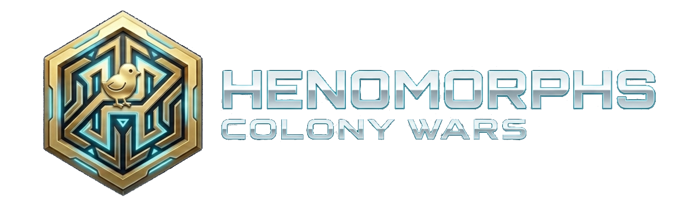

<p align="center">
  
</p>

<h1 align="center">🐣 HENOMORPHS</h1>

<p align="center">
  <strong>Cyberpunk Chicken Warriors • Strategic Territory Warfare • Blockchain Gaming</strong>
</p>

<p align="center">
  <a href="https://henomorphs.xyz">Website</a> •
  <a href="https://discord.gg/E8aGBKDp7W">Discord</a> •
  <a href="https://x.com/cryptocolony42">Twitter</a>
</p>

<p align="center">
  
  
  
</p>

---

## ⚡ Welcome to the Digital Arena

**Henomorphs** is a next-generation blockchain gaming ecosystem where cyberpunk chickens rise from humble origins to become legendary warriors. Engage in strategic territorial warfare, evolve your NFTs through multiple tiers, and compete for dominance across 50 unique territories.

Built on Polygon for lightning-fast transactions and minimal fees, Henomorphs combines deep strategic gameplay with sustainable tokenomics and a thriving community.

---

## 🎮 Core Gameplay

### Colony Wars
The heart of Henomorphs - an epic strategic warfare system where player-formed colonies battle for territorial supremacy.

```
┌─────────────────────────────────────────────────────────────────┐
│                     COLONY WARS PHASES                          │
├────────────────┬────────────────┬───────────────┬───────────────┤
│  PREPARATION   │   EXPANSION    │   CONFLICT    │  RESOLUTION   │
│  Build forces  │ Capture neutral│ Colony vs     │ Final battles │
│  Form alliances│  territories   │   Colony      │ Claim rewards │
└────────────────┴────────────────┴───────────────┴───────────────┘
```

### Battle System
Deploy your Henomorphs in strategic squad formations. Victory depends on:

- **Power Calculation** — Base stats × evolution tier × augments × synergy bonuses
- **Battle Strategies** — Aggressive, Balanced, Defensive, or Blitz tactics
- **Squad Synergy** — Matching factions and tiers for up to +25% bonus
- **Territory Advantages** — Terrain bonuses that can turn the tide

### Territory Control
Command 50 territories across 5 unique biomes:

| Biome | Attack | Defense | Special |
|-------|--------|---------|---------|
| 🌲 **Forest** | — | +5% | +15% Energy Regen |
| 🏜️ **Desert** | +20% | — | +10% Speed |
| 🌊 **Ocean** | — | +15% | +10% Trade Income |
| ⛰️ **Mountain** | — | +25% | +10% Visibility |
| 🏙️ **Urban** | +15% | +15% | +20% YLW Production |

---

## 🧬 Evolution System (Biopod)

Your Henomorphs evolve through 4 powerful tiers, each unlocking greater strength:

```
         ╔═══════════════════════════════════════════╗
         ║           EVOLUTION PATHWAY               ║
         ╠═══════════════════════════════════════════╣
         ║                                           ║
         ║   TIER 1        TIER 2        TIER 3      ║
         ║    Core    →    Chick    →    Fowl        ║
         ║   (Base)      (+25%)       (+50%)         ║
         ║                                           ║
         ║                     ↓                     ║
         ║                                           ║
         ║         TIER 4              TIER 5        ║
         ║          Hen       →       PRIME          ║
         ║        (+75%)            (+100%)          ║
         ║                                           ║
         ╚═══════════════════════════════════════════╝
```

### Genesis Line → **PECK PRIME**
*"In the neon-lit streets of the digital frontier, Peck Prime rose from humble beginnings. What started as a simple chick became a legend through relentless evolution and mechanical augmentation."*

### Matrix Line → **META PRIME**
*"Born from the quantum fluctuations of the digital matrix, Meta Prime exists between realities. Having mastered the art of data manipulation, this entity leads with unparalleled processing power and strategic brilliance."*

---

## ⚡ Energy Management (Chargepod)

Every staked Henomorph maintains an energy level that powers their actions:

```
CHARGE LEVEL: ████████████████░░░░ 80%

┌──────────────────────────────────────┐
│ Base Regeneration    │    +10%/day   │
│ Evolution Bonus      │    +35%       │
│ Territory Control    │    +15%       │
│ Augment Bonus        │    +20%       │
│ Alliance Support     │    +10%       │
└──────────────────────────────────────┘
```

Manage your energy wisely — every battle, mission, and strategic action consumes charge!

---

## 🎴 NFT Collections

### Main Characters
| Collection | Supply | Theme | Evolution Path |
|------------|--------|-------|----------------|
| **Genesis** | 2,300 | Steampunk/Mechanical | → Peck Prime |
| **Matrix** | 2,100 | Quantum/Digital | → Meta Prime |

### Power-Ups & Augments

Augments supercharge your Henomorphs with Matrix-inspired abilities:

| Rarity | Name | Power Boost |
|--------|------|-------------|
| ⬜ Common | Sealed Potential | +8% |
| 🟦 Uncommon | Follow The Rabbit | +15% |
| 🟪 Rare | There Is No Spoon | +30% |
| 🟨 Legendary | **I Am The One** | +50% |

### Strategic Assets
- **Territory Cards** (50) — Control zones in Colony Wars
- **Infrastructure Cards** (4,000) — Boost production & defense
- **Resource Cards** (5,500) — Fuel operations & upgrades

---

## 💎 Dual-Token Economy

### ZICO (Governance)
```
Supply: Fixed (Scarce)
Uses:  Colony creation • Territory capture • Premium features • DAO voting
```

### YLW (Utility)
```
Supply: Elastic (Player-adjusted)
Earn:  Daily staking • Battle victories • Territory control • Achievements
Spend: Evolution • Augments • Energy boosts • In-game transactions
```

> 🔒 **Community Exclusive** — Tokens available only to Cryptocolony42 members via ZicoSwap

---

## 🏰 Alliance System

Form powerful coalitions with other colonies:

- **Offensive Alliances** — Combined military strikes
- **Defensive Pacts** — Mutual protection agreements
- **Trade Agreements** — Resource sharing networks
- **Full Cooperation** — Complete strategic integration

---

## 🌐 Play Now

<table>
<tr>
<td align="center" width="33%">

### 🖥️ Web App
[henomorphs.xyz](https://henomorphs.xyz)

NFT Gallery • Staking • Colony Wars

</td>
<td align="center" width="33%">

### 📱 Mobile
Android & iOS Beta

Full gameplay on the go

</td>
<td align="center" width="33%">

### 💬 Community
[Discord](https://discord.gg/E8aGBKDp7W)

500+ Warriors

</td>
</tr>
</table>

---

## 📊 At a Glance

```
┌────────────────────────────────────────────────────────────────┐
│                    HENOMORPHS ECOSYSTEM                        │
├────────────────────────────────────────────────────────────────┤
│  Total NFTs          │  16,300+                                │
│  Collections         │  8 unique types                         │
│  Territories         │  50 across 5 biomes                     │
│  Evolution Tiers     │  5 (Core → Prime)                       │
│  Battle Strategies   │  4 tactical approaches                  │
│  Network             │  Polygon (Chain ID: 137)                │
│  Community           │  500+ members in ZicoDAO                │
└────────────────────────────────────────────────────────────────┘
```

---

## 📜 Deployed Contracts

All contracts are deployed on **Polygon Mainnet** (Chain ID: 137)

### 💎 Diamond Architecture (EIP-2535)

| Contract | Address | Description |
|----------|---------|-------------|
| **Staking Diamond** | [`0xA16C7963be1d90006A1D36c39831052A89Bc97BE`](https://polygonscan.com/address/0xA16C7963be1d90006A1D36c39831052A89Bc97BE) | Core staking & rewards logic |
| **Chargepod Diamond** | [`0xA899050674ABC1EC6F433373d55466342c27Db76`](https://polygonscan.com/address/0xA899050674ABC1EC6F433373d55466342c27Db76) | Energy management & Colony Wars |
| **Collections Diamond** | [`0x8AAb21E086FDA555d682B64fd9368836D5859e5E`](https://polygonscan.com/address/0x8AAb21E086FDA555d682B64fd9368836D5859e5E) | Modular NFT system |

### 🐣 NFT Collections

| Collection | Address | Supply |
|------------|---------|--------|
| **Henomorphs Genesis** | [`0x4B13EA1896599129dF5415910d6A38772a1EAAfb`](https://polygonscan.com/address/0x4B13EA1896599129dF5415910d6A38772a1EAAfb) | 2,300 |
| **Henomorphs Matrix** | [`0x3999b6d269a1711223E0A72CB1AF73cbC1E6917C`](https://polygonscan.com/address/0x3999b6d269a1711223E0A72CB1AF73cbC1E6917C) | 2,100 |
| **Henomorphs Conduit** | [`0x0275179C97BfE26e3F464F191DBCF97B003f0BA3`](https://polygonscan.com/address/0x0275179C97BfE26e3F464F191DBCF97B003f0BA3) | Entry tokens |
| **Augments V1** | [`0x41271DfDa3AEc48F445d17a096e82B5251D0B4f9`](https://polygonscan.com/address/0x41271DfDa3AEc48F445d17a096e82B5251D0B4f9) | Genesis augments |
| **Augments V2** | [`0x4728CE1F5ba75f2F73Afa96a7D9055Fc0EEaa56e`](https://polygonscan.com/address/0x4728CE1F5ba75f2F73Afa96a7D9055Fc0EEaa56e) | Matrix augments |
| **Territory Cards** | [`0x01AeeC0a113419902Cd51d254FdDAfA1d2d35e9c`](https://polygonscan.com/address/0x01AeeC0a113419902Cd51d254FdDAfA1d2d35e9c) | 50 territories |
| **Infrastructure Cards** | [`0x0Ba576451F84B54c33B292AB15F5d571F87E2d89`](https://polygonscan.com/address/0x0Ba576451F84B54c33B292AB15F5d571F87E2d89) | 4,000 |
| **Resource Cards** | [`0x84253294Ef7B11A0574A1659847e2321b7975101`](https://polygonscan.com/address/0x84253294Ef7B11A0574A1659847e2321b7975101) | 5,500 |
| **Henomorphs Achievements** | [`0xC76D58BaD18A61a8b5093A96d0506D70340312c6`](https://polygonscan.com/address/0xC76D58BaD18A61a8b5093A96d0506D70340312c6) | ERC-1155 badges |
| **Colonial Crests** | [`0x7C95e4cb423AA85A7247E527c0bfD27132Be01fE`](https://polygonscan.com/address/0x7C95e4cb423AA85A7247E527c0bfD27132Be01fE) | Colony emblems |
| **stkHeno** | [`0xeD927994Fc3bbFB998D927EF318C90540D51d227`](https://polygonscan.com/address/0xeD927994Fc3bbFB998D927EF318C90540D51d227) | Staking receipts |

### 💰 Tokens

| Token | Address | Type |
|-------|---------|------|
| **ZICO** | [`0x486ebcFEe0466Def0302A944Bd6408cD2CB3E806`](https://polygonscan.com/address/0x486ebcFEe0466Def0302A944Bd6408cD2CB3E806) | Governance |
| **YELLOW (YLW)** | [`0x79e60C812161eBcAfF14b1F06878c6Be451CD3Ef`](https://polygonscan.com/address/0x79e60C812161eBcAfF14b1F06878c6Be451CD3Ef) | Utility |

---

## 🔗 Quick Links

| Resource | Link |
|----------|------|
| 🎮 Play Now | [henomorphs.xyz](https://henomorphs.xyz) |
| 💬 Discord | [discord.gg/E8aGBKDp7W](https://discord.gg/E8aGBKDp7W) |
| 🐦 Twitter | [@cryptocolony42](https://x.com/cryptocolony42) |
| 🌐 Community | [cryptocolony42.com](https://cryptocolony42.com) |
| 💱 Token Swap | [swap.zicodao.io](https://swap.zicodao.io) |

---

<p align="center">
  <strong>Rise from the code. Conquer the digital frontier.</strong>
</p>

<p align="center">
  <sub>Built with ❤️ by the Cryptocolony42 community on Polygon</sub>
</p>
