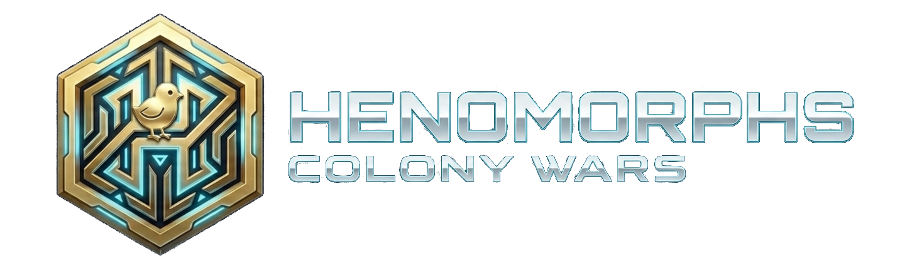

<p align="center">
  
</p>

<h1 align="center">HENOMORPHS</h1>

<p align="center">
  <strong>Smart Contract Monorepo</strong>
</p>

<p align="center">
  <a href="https://henomorphs.xyz">Website</a> &bull;
  <a href="https://discord.gg/E8aGBKDp7W">Discord</a> &bull;
  <a href="https://x.com/cryptocolony42">Twitter</a>
</p>

<p align="center">
  
  
  
  
</p>

---

Unified smart contract repository for the Henomorphs ecosystem — an NFT gaming platform on Polygon featuring staking, colony warfare, territory control, resource economy, and modular NFT collections built on the Diamond pattern (EIP-2535).

---

## Game Mechanics Overview

### Staking & Progression
NFTs are staked into the Staking Diamond and receive stkHeno receipt tokens. Staked specimens accumulate experience, level up, and earn YLW rewards. Each staked NFT tracks kinship, charge level, wear, and specialization stats (efficiency, regeneration, agility, intelligence) via the Biopod calibration system. Wear increases with use and must be repaired by burning YLW.

### Colony Wars
PvP battle system where players form colonies and wage wars for territorial control. Attackers stake ZICO tokens, set battle parameters, and resolve combat based on squad power (NFT level, accessories, specialization). Weather effects modify outcomes. Seasons structure warfare into registration and active combat periods. Asymmetric rewards incentivize aggression.

### Territory Control
50 territory cards (NFTs) represent controllable zones. Territories support up to 4 equipment slots (Mining Rig, Defense Turret, Research Lab) that provide passive bonuses. Siege and fortification mechanics govern territory conquest. A dedicated territory marketplace enables trading.

### Alliance System
Players create or join alliances with treaty mechanics (non-aggression pacts, trade agreements). Alliance wars enable team-based PvP. Treaties have active/expired lifecycle with associated bonuses.

### Resource Economy
Passive resource generation from territories and NFT activity. Multi-step processing system converts raw resources into refined materials via recipes. Collaborative crafting allows multiple players to contribute to shared projects. Resource cards (5,500 NFTs) fuel the economy.

### Minting & Variants
Collections Diamond handles multiple minting modes: standard mint, variant rolling (user-selected), auto-rolling (on-chain random), and mystery box (backend-controlled packs). Each NFT tracks per-tier variants (4 defaults per tier) with rerolling, permanent locking, and signature-based reservation. Whitelist access via Merkle proofs. Conduit system enables ecosystem-integrated minting with configurable token expiry and core limits.

### Augment System
Augment NFTs (V1 for Genesis, V2 for Matrix) attach to specimen NFTs with configurable lock duration (temporary or permanent). Assignment automatically creates matching accessories. Separate variant tracking for augments vs specimens. Configurable fees for assignment and lock extension.

### Charge & Energy
Every staked specimen maintains a charge level (0-100) that regenerates over time. Actions consume charge. Regeneration rate is modified by evolution level, territory control, accessories, and specialization. The Chargepod Diamond manages charge state, fatigue, boosts, and efficiency calculations.

### Dual-Token Economy
**ZICO** (governance) — fixed supply, used for colony creation, territory capture, war stakes, and DAO voting. **YLW** (utility) — elastic supply with daily mint limits per address, earned through staking/battles/territories, burned for repairs, evolution, augments, and marketplace fees. Both tokens are community-exclusive via ZicoSwap.

### Achievements & Prediction Markets
ERC-1155 achievement badges unlock YLW + ZICO rewards upon milestone completion. On-chain prediction markets use AMM-based liquidity pools for outcome betting with dispute resolution and automated settlement.

---

## Architecture

The system is composed of three Diamond proxies and a set of standalone contracts:

```
                         ┌──────────────────────────┐
                         │    Henomorphs Ecosystem   │
                         └────────────┬─────────────┘
              ┌───────────────────────┼───────────────────────┐
              v                       v                       v
   ┌─────────────────┐    ┌─────────────────┐    ┌─────────────────┐
   │ Staking Diamond  │    │Chargepod Diamond│    │Collections      │
   │                  │    │                 │    │Diamond (Modular)│
   │ Staking/Unstaking│    │ Colony Wars     │    │ Minting         │
   │ Reward Claims    │    │ Territory Wars  │    │ Variant Rolling │
   │ Infusion         │    │ Alliances       │    │ Augment System  │
   │ Wear System      │    │ Resources       │    │ Multi-Asset     │
   │ stkHeno Receipts │    │ Achievements    │    │ Catalog/Equip   │
   │                  │    │ Predictions     │    │ Whitelist       │
   │                  │    │ Charge/Biopod   │    │ Composition     │
   └────────┬─────────┘    └────────┬────────┘    └────────┬────────┘
            │                       │                       │
            v                       v                       v
   ┌──────────────────────────────────────────────────────────────┐
   │                      Protocol Layer                          │
   │  YellowToken (YLW) · PaymentProcessor · FeeManager          │
   │  CollectionManager · MarketplaceRegistry · ModuleManager     │
   └──────────────────────────────────────────────────────────────┘
            │                       │                       │
            v                       v                       v
   ┌──────────────────────────────────────────────────────────────┐
   │                    NFT Collections                           │
   │  Genesis · Matrix · Conduit · Augments V1/V2                 │
   │  Territory Cards · Infrastructure Cards · Resource Cards     │
   │  Boosters · Colonial Crests · Achievements · Coloring Book   │
   └──────────────────────────────────────────────────────────────┘
```

---

## Repository Structure

```
contracts/
├── diamonds/
│   ├── shared/                  # Diamond base (EIP-2535)
│   │   ├── facets/              # DiamondCut, DiamondLoupe, Ownership
│   │   ├── interfaces/          # IDiamondCut, IDiamondLoupe, IERC165/173
│   │   └── libraries/           # LibDiamond, LibMeta
│   ├── modular/                 # Collections Diamond
│   │   ├── facets/              # Catalog, Equippable, MultiAsset, Whitelist, CollectionView
│   │   ├── interfaces/          # IExternalSystems
│   │   ├── libraries/           # LibFeeCollection, MetadataFallback, SVG builders
│   │   └── utils/               # PodsUtils, ReentrancyGuard
│   ├── chargepod/               # Chargepod Diamond
│   │   └── libraries/           # Achievement triggers, SVG builders, storage libs
│   └── staking/                 # Staking Diamond
│       ├── interfaces/          # IStkHenoDescriptor, IColony*Cards
│       └── libraries/           # Achievement triggers, swap storage
├── protocol/
│   ├── economic/                # YellowToken, PaymentProcessor, BundleManager
│   ├── core/                    # CollectionManager, FeeManager, ModuleManager, MarketplaceRegistry
│   ├── trading/                 # AsksV1 marketplace
│   ├── analytics/               # EventEmitter, DataAggregator
│   ├── security/                # EmergencyControls
│   └── interfaces/              # IYellowToken
├── collections/
│   └── crests/                  # HenomorphsColonialCrests, CrestMetadata
├── conduit/
│   ├── interfaces/              # IConduit, IConduitMintController, IConduitTokenDescriptor
│   └── utils/                   # ConduitMintController
├── features/
│   ├── achievements/            # HenomorphsAchievements (ERC-1155), metadata, SVG
│   └── coloringbook/            # HenomorphsColoringBookE1, metadata descriptor
├── redemption/
│   ├── interfaces/              # IHenomorphsRedemption
│   └── storage/                 # RedemptionStorage
├── libraries/                   # Shared models & utilities
│   ├── CollectionModel.sol
│   ├── HenomorphsModel.sol
│   ├── StakingModel.sol
│   ├── GamingModel.sol
│   ├── MintingModel.sol
│   ├── BoostingModel.sol
│   ├── AirdropModel.sol
│   ├── ModularAssetModel.sol
│   ├── HenomorphsMetadata.sol
│   ├── PodsUtils.sol
│   └── ReentrancyGuard.sol
└── utils/                       # IssueHelper, NativePriceQuoter
```

---

## Key Contracts

### Diamond Facets

| Facet | Diamond | Purpose |
|-------|---------|---------|
| `DiamondCutFacet` | All | Add/replace/remove facets |
| `DiamondLoupeFacet` | All | Introspection (EIP-2535) |
| `OwnershipFacet` | All | Owner management (EIP-173) |
| `CatalogFacet` | Collections | Asset catalog management |
| `EquippableFacet` | Collections | Equippable NFT parts |
| `MultiAssetFacet` | Collections | Multi-asset NFTs |
| `WhitelistFacet` | Collections | Merkle proof whitelist |
| `CollectionViewFacet` | Collections | Collection read queries |

### Protocol

| Contract | Description |
|----------|-------------|
| `YellowToken` | ERC-20 utility token (YLW) — UUPS upgradeable, ERC20Votes, daily mint limits, burn mechanics |
| `PaymentProcessor` | Multi-token payment handling (ERC-20 + native), fee distribution, slippage protection |
| `CollectionManager` | Collection registry and fee management |
| `FeeManager` | Fee configuration and collection |
| `ModuleManager` | System module coordination |
| `MarketplaceRegistry` | Trading registry and order management |
| `AsksV1` | Marketplace ask/offer system |
| `BundleManager` | Multi-token bundle operations |
| `EmergencyControls` | Emergency pause/circuit-breaker |
| `EventEmitter` | Centralized event logging |
| `DataAggregator` | On-chain analytics aggregation |

### NFT Collections

| Collection | Type | Description |
|------------|------|-------------|
| `HenomorphsColonialCrests` | ERC-721 | Colony emblems with on-chain SVG metadata |
| `HenomorphsAchievements` | ERC-1155 | Achievement badges with dynamic SVG |
| `HenomorphsColoringBookE1` | ERC-721 | Coloring book edition 1 |
| `ConduitMintController` | — | Ecosystem mint conduit controller |

### On-Chain Metadata & SVG

| Library | Generates |
|---------|-----------|
| `TerritorySVGLib` / `TerritoryMetadataLib` | Territory card visuals (16x16 grid, terrain types) |
| `InfrastructureSVGLib` / `InfrastructureMetadataLib` | Infrastructure card visuals |
| `ResourceSVGLib` / `ResourceMetadataLib` | Resource card visuals |
| `StkHenoSVGBuilder` | Staking receipt token visuals |
| `AchievementSVGBuilder` / `AchievementMetadata` | Achievement badge visuals |
| `CrestMetadata` | Colonial crest visuals |
| `MetadataFallback` | Fallback metadata generation |

---

## Deployed Contracts (Polygon Mainnet)

### Diamonds

| Contract | Address |
|----------|---------|
| Staking Diamond | [`0xA16C7963be1d90006A1D36c39831052A89Bc97BE`](https://polygonscan.com/address/0xA16C7963be1d90006A1D36c39831052A89Bc97BE) |
| Chargepod Diamond | [`0xA899050674ABC1EC6F433373d55466342c27Db76`](https://polygonscan.com/address/0xA899050674ABC1EC6F433373d55466342c27Db76) |
| Collections Diamond | [`0x8AAb21E086FDA555d682B64fd9368836D5859e5E`](https://polygonscan.com/address/0x8AAb21E086FDA555d682B64fd9368836D5859e5E) |

### NFT Collections

| Collection | Address | Supply |
|------------|---------|--------|
| Henomorphs Genesis | [`0x4B13EA1896599129dF5415910d6A38772a1EAAfb`](https://polygonscan.com/address/0x4B13EA1896599129dF5415910d6A38772a1EAAfb) | 2,300 |
| Henomorphs Matrix | [`0x3999b6d269a1711223E0A72CB1AF73cbC1E6917C`](https://polygonscan.com/address/0x3999b6d269a1711223E0A72CB1AF73cbC1E6917C) | 2,100 |
| Henomorphs Conduit | [`0x0275179C97BfE26e3F464F191DBCF97B003f0BA3`](https://polygonscan.com/address/0x0275179C97BfE26e3F464F191DBCF97B003f0BA3) | — |
| Augments V1 | [`0x41271DfDa3AEc48F445d17a096e82B5251D0B4f9`](https://polygonscan.com/address/0x41271DfDa3AEc48F445d17a096e82B5251D0B4f9) | — |
| Augments V2 | [`0x4728CE1F5ba75f2F73Afa96a7D9055Fc0EEaa56e`](https://polygonscan.com/address/0x4728CE1F5ba75f2F73Afa96a7D9055Fc0EEaa56e) | — |
| Territory Cards | [`0x01AeeC0a113419902Cd51d254FdDAfA1d2d35e9c`](https://polygonscan.com/address/0x01AeeC0a113419902Cd51d254FdDAfA1d2d35e9c) | 50 |
| Infrastructure Cards | [`0x0Ba576451F84B54c33B292AB15F5d571F87E2d89`](https://polygonscan.com/address/0x0Ba576451F84B54c33B292AB15F5d571F87E2d89) | 4,000 |
| Resource Cards | [`0x84253294Ef7B11A0574A1659847e2321b7975101`](https://polygonscan.com/address/0x84253294Ef7B11A0574A1659847e2321b7975101) | 5,500 |
| Achievements | [`0xC76D58BaD18A61a8b5093A96d0506D70340312c6`](https://polygonscan.com/address/0xC76D58BaD18A61a8b5093A96d0506D70340312c6) | ERC-1155 |
| Colonial Crests | [`0x7C95e4cb423AA85A7247E527c0bfD27132Be01fE`](https://polygonscan.com/address/0x7C95e4cb423AA85A7247E527c0bfD27132Be01fE) | — |
| stkHeno | [`0xeD927994Fc3bbFB998D927EF318C90540D51d227`](https://polygonscan.com/address/0xeD927994Fc3bbFB998D927EF318C90540D51d227) | Staking receipts |

### Tokens

| Token | Address | Type |
|-------|---------|------|
| ZICO | [`0x486ebcFEe0466Def0302A944Bd6408cD2CB3E806`](https://polygonscan.com/address/0x486ebcFEe0466Def0302A944Bd6408cD2CB3E806) | Governance (ERC-20) |
| YELLOW (YLW) | [`0x79e60C812161eBcAfF14b1F06878c6Be451CD3Ef`](https://polygonscan.com/address/0x79e60C812161eBcAfF14b1F06878c6Be451CD3Ef) | Utility (ERC-20, UUPS) |

### Key Addresses

| Role | Address |
|------|---------|
| Treasury | `0x8B4F045d8127E587E3083baBB31D4bC35f0065Cc` |
| Biopod | [`0xCEaA5d6418198D827279313f0765d67d3ac4D61f`](https://polygonscan.com/address/0xCEaA5d6418198D827279313f0765d67d3ac4D61f) |
| MATIC/USD Price Feed | [`0xAB594600376Ec9fD91F8e885dADF0CE036862dE0`](https://polygonscan.com/address/0xAB594600376Ec9fD91F8e885dADF0CE036862dE0) |

---

## Tech Stack

| Layer | Technology |
|-------|------------|
| Language | Solidity 0.8.28 |
| Framework | Hardhat 3 |
| Compiler | `viaIR` enabled, optimizer 200 runs |
| Standards | EIP-2535 (Diamond), ERC-721, ERC-1155, ERC-20, UUPS |
| Dependencies | OpenZeppelin 5.4, Chainlink 1.5, PRBMath 4.1 |
| Tooling | TypeScript 5.8, Viem, Hardhat Ignition |
| Testing | Foundry (forge-std), Hardhat |
| Network | Polygon (137), Sepolia (testnet) |

---

## Development

### Prerequisites

- Node.js 20+
- npm

### Setup

```bash
npm install
```

### Compile

```bash
npx hardhat compile
```

### Test

```bash
npx hardhat test
```

### Networks

| Network | Config name | Chain ID |
|---------|-------------|----------|
| Polygon Mainnet | — | 137 |
| Sepolia (testnet) | `sepolia` | 11155111 |
| Hardhat (local) | `hardhatMainnet` / `hardhatOp` | — |

---

## Links

| Resource | URL |
|----------|-----|
| Web App | [henomorphs.xyz](https://henomorphs.xyz) |
| Discord | [discord.gg/E8aGBKDp7W](https://discord.gg/E8aGBKDp7W) |
| Twitter | [@cryptocolony42](https://x.com/cryptocolony42) |
| Community | [cryptocolony42.com](https://cryptocolony42.com) |
| Token Swap | [swap.zicodao.io](https://swap.zicodao.io) |

---

<p align="center">
  <sub>Built by Cryptocolony42 on Polygon</sub>
</p>
